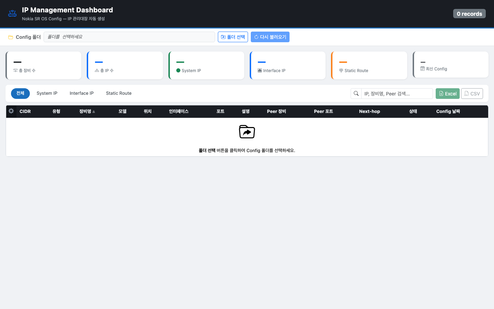

# Nokia & Arista Config IP Manager

> Nokia SR OS 및 Arista EOS 장비의 config 파일을 파싱하여 IP 관리대장을 자동으로 생성하는 웹 대시보드

[](https://github.com/20eung/network-config-ip-manager/releases/tag/v1.4.0)
[](https://www.python.org/)
[](https://flask.palletsprojects.com/)
[](https://getbootstrap.com/)
[](https://www.docker.com/)
[]()
[]()

> **브랜치 안내**
> - `main` (현재): **standalone 버전** — 로컬 PC 폴더를 브라우저에서 직접 업로드하여 사용
> - `server`: **서버 연동 버전** — NetDevOps Portal과 통합, 서버 디렉토리 자동 로드 + Authentik 인증

---

## Overview

네트워크 엔지니어가 수십~수백 개의 config 파일을 수동으로 분석하지 않아도, 폴더를 선택하는 것만으로 Nokia와 Arista 장비의 전체 IP 현황을 자동 집계하고 Excel/CSV로 내보낼 수 있습니다.

**벤더 자동 감지:** Nokia TiMOS와 Arista EOS 파일이 동일 폴더에 혼재해도 자동 구분하여 파싱합니다.

**주요 처리 대상:**
- **System IP** — Loopback (`/32`)
- **Interface IP** — 물리 포트, LAG 포트, SVI(VLAN 인터페이스), IES 서비스 인터페이스
- **Static Route** — 목적지 CIDR + Next-hop + 출구 인터페이스 자동 추론

Peer 장비는 Next-hop IP 역방향 매핑과 인터페이스 Description 패턴 분석을 통해 자동 식별됩니다.

---

## Screenshot



---

## Features

- 📁 **로컬 폴더 업로드** — 사용자 PC의 config 폴더를 브라우저에서 직접 선택 (서버 설치 불필요)
- 🔍 **실시간 검색 & 필터** — IP 유형별 탭 + 키워드 검색
- 📊 **통계 대시보드** — 장비 수, IP 수, 유형별 집계, 최신 Config 날짜
- ⚙️ **컬럼 커스터마이즈** — 표시 여부 토글 + 드래그로 순서 변경 + 마우스로 너비 조절 (localStorage 영구 저장)
- 📤 **내보내기** — Excel (4개 시트: 전체/Interface IP/Static Route/장비 목록) & CSV
- 🐳 **Docker 지원** — `docker-compose up` 한 줄로 실행
- 🔒 **폐쇄망 환경 완전 지원** — CDN 의존성 없이 정적 파일 내장
- 🗂️ **중복 파일 자동 처리** — 동일 장비의 날짜별 config 중 최신 파일만 파싱
- 🔄 **멀티벤더 지원** — Nokia TiMOS / Arista EOS 파일 자동 감지 및 혼합 디렉토리 파싱

### Nokia 파서 지원 기능

| 기능 | 상세 |
|------|------|
| **OS 버전 통합 파싱** | TiMOS-B(SAS/SAR)/C(SR/ESS) 전 버전, ALCATEL-LUCENT/ALCATEL/Nokia 벤더명 자동 감지 |
| **router 블록** | `router`(구버전) / `router Base`(신버전) 모두 지원 |
| **IES 서비스 인터페이스** | BB 장비의 `service > ies` 블록 파싱, 이중 블록 구조 처리 |
| **Static Route 형식** | inline(`static-route`, 구버전) + block(`static-route-entry`, 신버전) 동시 지원 |
| **Static Route 인터페이스 추론** | Next-hop IP → 로컬 서브넷 매핑으로 출구 인터페이스·포트 자동 식별 |
| **SAP 없는 인터페이스** | SAP 블록 미존재 시 인터페이스명(`p3/1/10`)에서 포트 번호 자동 추론 |
| **LAG 포트** | `lag-N` 형식 지원 |

### Arista 파서 지원 기능

| 기능 | 상세 |
|------|------|
| **L3 인터페이스 감지** | `no switchport` 키워드로 L3 모드 자동 식별 |
| **인터페이스 종류** | Ethernet, Port-Channel, Loopback, Vlan(SVI), Management |
| **모듈형 섀시 포트** | `EthernetS/C/N` 형식 (7304X3 등) 지원 |
| **VRF 인터페이스** | `vrf instance` 선언 + 인터페이스 내 `vrf` 귀속 파싱 |
| **Static Route 형식** | Global / VRF / 출구 인터페이스 명시 / name 필드 4가지 조합 |
| **VRRP / Virtual-Router IP** | `vrrp N ipv4` 및 `ip virtual-router address` 가상 IP 파싱 |
| **인터페이스 숏네임** | `Ethernet3 → Et3`, `Vlan75 → Vl75`, `Loopback0 → Lo0` (포트 컬럼) |
| **BGP 정보** | `router bgp N` 블록에서 AS 번호 및 Router ID 추출 |
| **config 날짜** | 파일명에서 날짜 추출 (`_YYYYMMDD.txt` 형식) |

---

## Supported Devices & OS Versions

### Nokia SR OS

| 장비 모델 | TiMOS 버전 | 비고 |
|----------|-----------|------|
| Nokia 7705 SAR | TiMOS-B-6.1.x | ALCATEL-LUCENT 벤더명, Copyright 다음 줄 형식 |
| Nokia 7210 SAS-M/X | TiMOS-B-7.0.x | ALCATEL 벤더명 |
| Nokia 7210 SAS-Mxp | TiMOS-B-8.0.x ~ B-25.x | Nokia 브랜드 이후 버전 포함 |
| Nokia 7210 SAS-Sx | TiMOS-B-22.x ~ B-25.x | |
| Nokia 7750 SR | TiMOS-B-12.x, C-12.x ~ C-22.x | MPLS/BB 장비 모두 지원 |
| Nokia 7450 ESS | TiMOS-C-12.x | LAG 포트 환경 |

> 파서 구현 상세 및 버전별 문법 차이는 [Nokia TiMOS Config 문법 레퍼런스](docs/nokia-timos-config-syntax.md)를 참조하세요.

### Arista EOS

| 장비 모델 | EOS 버전 | 역할 | 비고 |
|----------|---------|------|------|
| DCS-7020SR-24C2 | 4.27.6M | Leaf / EVPN | Ethernet 1~24, QSFP 분할 포트 |
| DCS-7280SR2-48YC6 | 4.23.0F, 4.32.5.1M | BB / BR | Ethernet 1~48, Ethernet49/1~54/1 |
| DCS-7304 | 4.24.3M | Spine (Modular) | Ethernet S/C/N 슬롯/카드/포트 형식 |

> 파서 구현 상세 및 EOS 문법은 [Arista EOS Config 문법 레퍼런스](docs/arista-eos-config-syntax.md)를 참조하세요.

---

## Parsed Data Fields

config 파일에서 추출하는 필드 목록입니다.

| 필드 | Nokia | Arista | 설명 |
|------|:-----:|:------:|------|
| CIDR | ✅ | ✅ | IP 주소 + Prefix (예: `192.0.2.1/30`) |
| IP 유형 | ✅ | ✅ | System IP / Interface IP / Static Route |
| 장비명 | ✅ | ✅ | Nokia: `name` 값, Arista: `hostname` 명령 |
| 장비 모델 | ✅ | ✅ | Nokia: TiMOS 헤더, Arista: `! device:` 줄 |
| 위치 | ✅ | — | Nokia config 내 `location` 값 |
| OS 버전 | ✅ | ✅ | Nokia: TiMOS 버전, Arista: EOS 버전 |
| 인터페이스 | ✅ | ✅ | 인터페이스 풀네임 |
| 포트 | ✅ | ✅ | Nokia: 물리 포트/LAG, Arista: 숏네임 (Et3, Vl75, Lo0) |
| 포트 설명 | ✅ | ✅ | 포트/인터페이스 description |
| Peer 장비 | ✅ | ✅ | Next-hop 역맵 또는 description 패턴으로 자동 추출 |
| Peer 포트 | ✅ | ✅ | Peer 장비의 연결 포트 |
| Next-hop IP | ✅ | ✅ | Static Route의 next-hop 주소 |
| 상태 | ✅ | ✅ | Active / Shutdown |
| Config 날짜 | ✅ | ✅ | Nokia: `Generated` 헤더, Arista: 파일명에서 추출 |
| Router ID | ✅ | ✅ | BGP/OSPF Router ID |
| AS 번호 | ✅ | ✅ | Autonomous System 번호 |

---

## Tech Stack

| 구분 | 기술 |
|------|------|
| Backend | Python 3.11, Flask |
| Parser | 순수 Python (정규식 + 들여쓰기 기반 블록 파싱), 벤더 자동 감지 |
| Frontend | Bootstrap 5.3, Bootstrap Icons, SortableJS (로컬 내장) |
| Export | openpyxl (Excel), csv |
| 인프라 | Docker, docker-compose |

---

## Prerequisites

**Docker 사용 시 (권장):**
- Docker Desktop (또는 Docker Engine + docker-compose)

**로컬 실행 시:**
- Python 3.11+
- pip

---

## Getting Started

### Docker (권장)

```bash
git clone https://github.com/20eung/network-config-ip-manager.git
cd network-config-ip-manager

docker-compose up -d
```

브라우저에서 http://localhost:5001 접속 후 **폴더 선택** 버튼으로 로컬 PC의 config 폴더를 지정합니다.

### 로컬 실행

```bash
git clone https://github.com/20eung/network-config-ip-manager.git
cd network-config-ip-manager

pip install -r requirements.txt
python app.py
```

---

## Usage

1. 브라우저에서 http://localhost:5001 접속
2. **폴더 선택** 클릭 → OS 파일 탐색기에서 config 파일이 있는 폴더 선택 (Nokia/Arista 혼합 폴더 가능)
3. 자동으로 벤더 감지 후 파싱 → IP 목록 표시
4. 상단 탭(전체 / System IP / Interface IP / Static Route)으로 필터링
5. 검색창에서 키워드 검색 (IP, 장비명, Peer 장비명 등)
6. `⚙` 아이콘으로 컬럼 표시 여부 및 순서 조정
7. 컬럼 헤더 우측 끝을 드래그하여 너비 조절
8. **Excel** 또는 **CSV** 버튼으로 내보내기
9. **다시 불러오기** 버튼으로 동일 폴더를 재파싱

### Config 파일 형식

**Nokia SR OS (TiMOS):**
```
# TiMOS-C-20.10.R13 cpm/hops64 Nokia 7750 SR Copyright (c) 2000-2022 Nokia.
# Generated WED JAN 21 03:31:37 2026 UTC
...
```

**Arista EOS:**
```
! Command: show running-config
! device: HOSTNAME (DCS-7020SR-24C2, EOS-4.27.6M)
!
hostname HOSTNAME
...
```

파일명 규칙: `{hostname}_{YYYYMMDD}.txt` (권장)

동일 장비의 날짜별 파일이 여러 개 있을 경우 **가장 최신 파일만** 자동 선택됩니다.

서브디렉토리 구조도 지원됩니다 — 하위 폴더에 있는 `.txt` 파일도 모두 자동으로 파싱됩니다.

---

## Project Structure

```
network-config-ip-manager/
├── app.py                  # Flask 애플리케이션 (API 라우트)
├── parser/
│   ├── ip_parser.py        # Nokia SR OS config 파서 + 벤더 라우팅
│   └── arista_parser.py    # Arista EOS config 파서
├── templates/
│   └── index.html          # 단일 페이지 대시보드 (Bootstrap 5)
├── static/
│   ├── css/                # Bootstrap, Bootstrap Icons (로컬 내장)
│   └── js/                 # Bootstrap Bundle, SortableJS (로컬 내장)
├── docs/
│   ├── images/             # README 스크린샷
│   ├── nokia-timos-config-syntax.md   # Nokia TiMOS 버전별 문법 레퍼런스
│   └── arista-eos-config-syntax.md    # Arista EOS 문법 레퍼런스
├── requirements.txt
├── Dockerfile
├── docker-compose.yml
└── .gitignore
```

---

## API Endpoints

| Method | Endpoint | 설명 |
|--------|----------|------|
| `GET` | `/` | 대시보드 페이지 |
| `POST` | `/api/upload` | config 파일 업로드 및 파싱 (Nokia/Arista 자동 감지) |
| `GET` | `/api/export/excel` | Excel 다운로드 |
| `GET` | `/api/export/csv` | CSV 다운로드 |

---

## Environment Variables

| 변수 | 기본값 | 설명 |
|------|--------|------|
| `SECRET_KEY` | 랜덤 생성 | Flask 세션 시크릿 키 |

---

## Documentation

| 문서 | 설명 |
|------|------|
| [Nokia TiMOS Config 문법 레퍼런스](docs/nokia-timos-config-syntax.md) | OS 버전별 config 문법 차이, 파싱 정규식, Python 구현 예시 |
| [Arista EOS Config 문법 레퍼런스](docs/arista-eos-config-syntax.md) | EOS 인터페이스/Static Route 문법, VRF/VRRP 구조, Python 구현 예시 |

---

## Roadmap

- [x] Nokia SR OS config 파싱 (System IP, Interface IP, Static Route)
- [x] Arista EOS config 파싱 (v1.3.0)
- [x] Nokia/Arista 혼합 폴더 자동 파싱 (벤더 자동 감지)
- [x] 컬럼 너비 마우스 드래그 조절 (v1.3.0)
- [x] 서브디렉토리 재귀 파싱 지원
- [ ] VPRN / VPLS 인터페이스 파싱 지원
- [ ] IP 중복 검사 기능
- [ ] 변경 이력 비교 (이전 파싱 결과와 diff)

---

## License

MIT License
